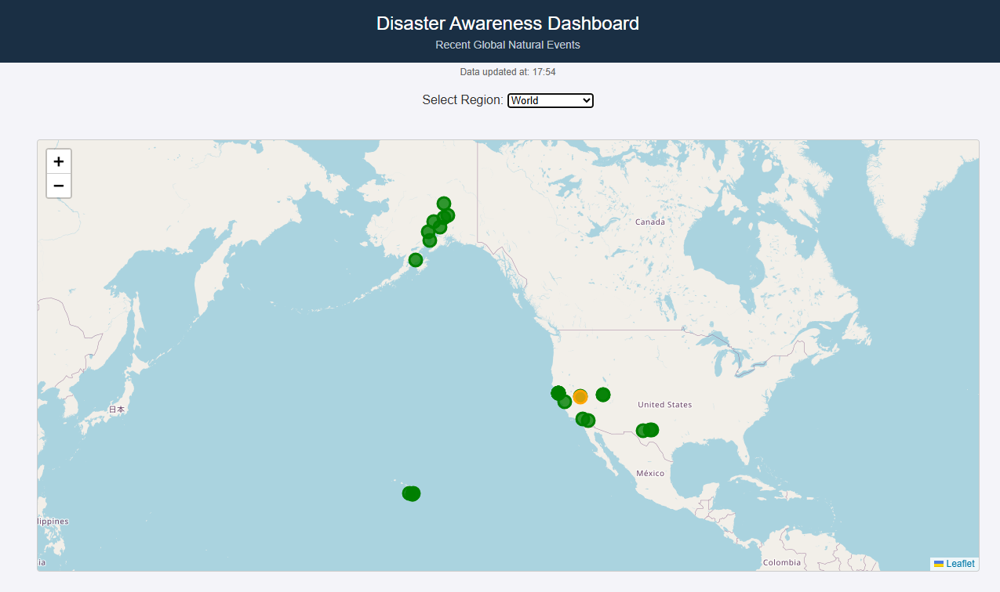
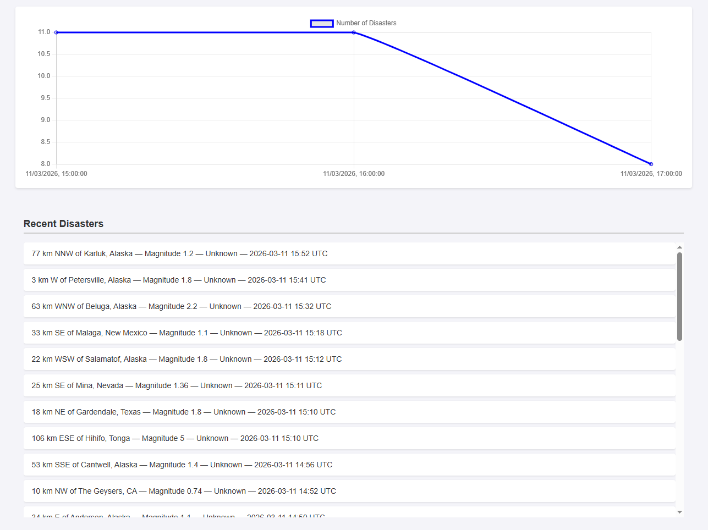

# Disaster Awareness Dashboard




## 🌍 Project Idea
The **Disaster Awareness Dashboard** is a web-based application designed to centralize and visualize information about recent natural disasters (specifically earthquakes) and the environmental conditions surrounding them. By observing a fully interactive world map and a dynamic timeline, users can rapidly understand where events are occurring and what the local situation looks like without having to navigate multiple data sources.

## 💡 Why This is a Good Idea
In an increasingly connected world, having immediate, centralized oversight of natural disasters alongside localized environmental metrics (like weather conditions) goes beyond simple geography—it gives a clearer picture of immediate ground reality. This specific tool is designed for educational and informational awareness (rather than emergency coordination). It demonstrates API integration as we get data and present it in a user-friendly dashboard.

## 🚀 Behind the code

1. **Backend Service Structure**: Designed a robust Node.js and Express.js backend. The server manage calls behind the scenes so the frontend client never needs to manage API keys or deal with multiple asynchronous public endpoints directly.
2. **Data Aggregation**: Built three distinct services (`earthquakeService`, `weatherService`, `locationService`) that we combine their outputs into one complete JSON packet.
3. **Frontend Dashboard**: Programmed a vanilla HTML, CSS, and JS frontend serving as the dashboard.
   - Integrated **Leaflet.js** to map disasters dynamically using color-coded magnitudes.
   - Integrated **Chart.js** to visualize the incident frequencies hour by hour.

4. **Resiliency**: Built the app to auto-refresh every 10 minutes without refreshing the page manually, allowing continuous unattended monitoring. Implemented try-catch fallbacks so the app never breaks down if one API is temporarily unavailable.

## 🔗 The 3 APIs We Use
Our backend (`/api/disasters`) powers the dashboard by merging data from three external sources:

1. **USGS Earthquake API** (`https://earthquake.usgs.gov/fdsnws/event/1/query`)
   - **Role**: Serves as the primary data source. Fetches the 30 most recent global earthquakes as GeoJSON data. 
   - **Data Extracted**: Earthquake magnitudes, timestamps, and geographic coordinates [Longitude, Latitude].

2. **Open-Meteo Weather API** (`https://api.open-meteo.com/v1/forecast`)
   - **Role**: Provides the environmental conditions around the disaster event zone.
   - **Data Extracted**: Live parameters including temperature (°C) and current windspeed.

3. **BigDataCloud Reverse Geocoding API** (`https://api.bigdatacloud.net/data/reverse-geocode-client`)
   - **Role**: This API takes the earthquake's lat/long and triangulates the actual territorial boundaries.
   - **Data Extracted**: Localized Country and City names.

## 💻 How to Start the App

### Prerequisites
Make sure you have Node.js and `npm` installed on your machine.

### Installation & Running
1. Clone the repository or navigate to the project root directory in your terminal:
   ```bash
   cd path/to/TAD-Tema1
   ```
2. Install the necessary dependencies:
   ```bash
   npm install
   ```
3. Start the application backend server:
   ```bash
   node server.js
   ```
4. Open your  web browser and navigate to:
   ```
   http://localhost:3000
   ```

## 📦 List of Dependencies
- **Backend (Node.js)**:
  - `express`: Robust web framework to serve the API and static frontend.
  - `axios`: Promise-based HTTP client used to seamlessly handle all external public API GET requests securely.
- **Frontend (CDNs)**:
  - `Leaflet.js`: Open-source JavaScript library for interactive maps.
  - `Chart.js`: Simple yet highly flexible charting tool for the timeline line-graph display.
